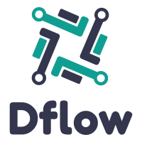

# DFlow - Domain Events Flow

   

## About Project
A C# reference implementation DDD architecture

## Documentation

## Contrib

## Who is using

## License
  This Source Code Form is subject to the terms of the Mozilla Public
  License, v. 2.0. If a copy of the MPL was not distributed with this
  file, You can obtain one at http://mozilla.org/MPL/2.0/.
